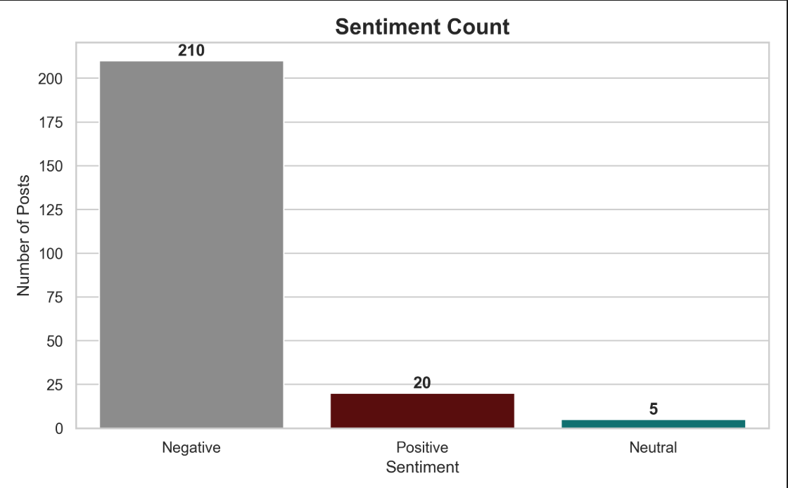
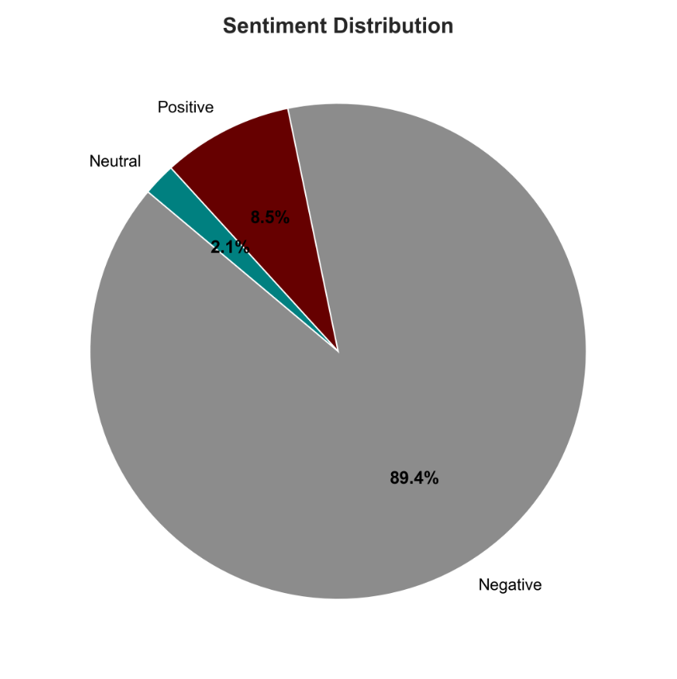
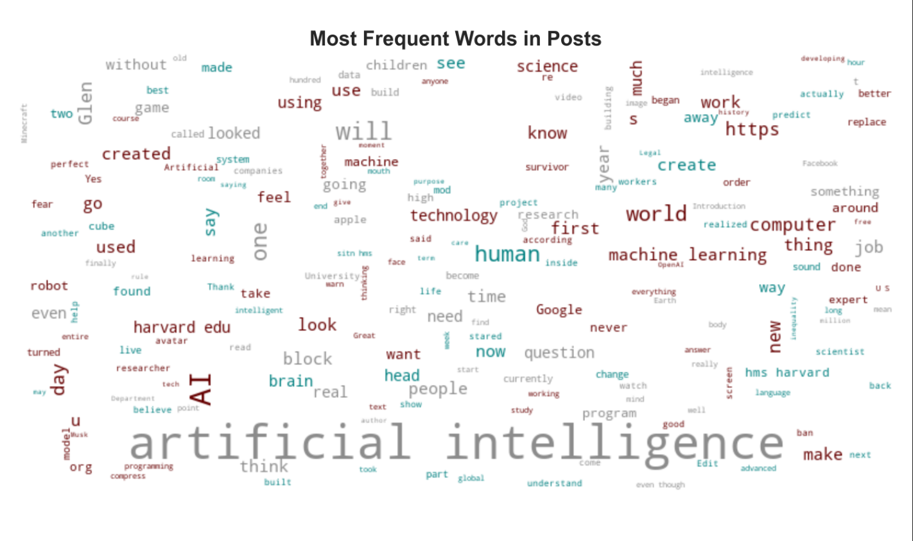

# 🤖 Reddit Sentiment Analysis on Artificial Intelligence

This project performs sentiment analysis on Reddit posts related to **Artificial Intelligence** using Natural Language Processing (NLP). It also includes a **custom search option**, so you can analyze sentiments on any topic of your choice.

---

## 📌 Features

- 🔍 Scrape Reddit posts using custom queries via the PRAW API
- 💬 Perform sentiment analysis (Positive / Negative / Neutral)
- 📊 Visualize results with bar charts, pie charts, and word clouds
- 🎨 Emojis to make the app visually engaging
- ☁️ Clean, interactive interface built with **Streamlit**
- 📝 Includes a full project report (`REPORT.md`)

---

## 📂 Project Structure
```
reddit_sentiment_analysis/
├── app.py # Main Streamlit app
├── REPORT.md 
├── README.md 
├── requirements.txt # Python dependencies
├── src/
│ ├── config.py
│ ├── data/
│ │ ├── output.csv # Raw scraped data
│ │ └── output_sentiment.csv 
│ ├── reddit_scraper.py 
│ ├── sentiment_analysis.py
│ └── visualizations/
│ ├── sentiment_bar_chart.png
│ ├── sentiment_pie_chart.png
│ └── sentiment_wordcloud.png
└── model/
└── sentiment.py 
```

## 🚀 How to Run the App

### 1. Clone the Repository
```bash
git clone https://github.com/YOUR_USERNAME/reddit-sentiment-analysis.git
cd reddit_sentiment_analysis
2. Create Virtual Environment (Optional)
bash
Copy code
python -m venv venv
venv\Scripts\activate      # On Windows
# or
source venv/bin/activate   # On macOS/Linux
3. Install Requirements
bash
Copy code
pip install -r requirements.txt
4. Add Reddit API Credentials
In src/config/reddit.py, fill in your details:
python
Copy code
client_id = "YOUR_CLIENT_ID"
client_secret = "YOUR_CLIENT_SECRET"
user_agent = "YOUR_USER_AGENT"
5. Run the Streamlit App
bash
Copy code
streamlit run app.py
```
## 🧪 Default Query
The app uses the query: artificial intelligence
You can also use the custom search bar to try:

"mental health in college"

"AI in education"

"climate change"

"remote jobs"

## 🛠️ Technologies Used
Python

Streamlit

PRAW (Reddit API Wrapper)

VADER Sentiment Analysis (NLTK)

Pandas, Matplotlib, WordCloud

## 📈 Output Charts

### 📊 Sentiment Bar Chart


### 🥧 Sentiment Pie Chart


### ☁️ Word Cloud of Frequent Words



## 🙋‍♀️ Author
Jhil Chatterjee
LinkedIn | GitHub


